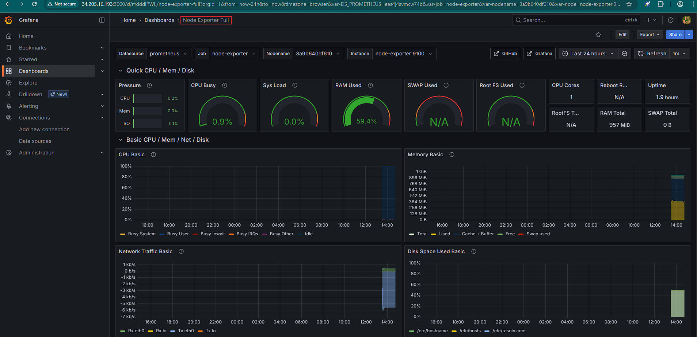

# 🚀 Monitoring Stack with Prometheus, Grafana, and Alertmanager

This project sets up a full-featured monitoring solution using **Prometheus**, **Grafana**, **Node Exporter**, and **Alertmanager**. It is deployed on an **AWS EC2 instance** using **Docker Compose**.


---

## 🔧 Stack Components

| Component         | Purpose                                                |
|------------------|--------------------------------------------------------|
| **Prometheus**    | Scrapes and stores metrics data from Node Exporter    |
| **Grafana**       | Visualizes metrics in beautiful dashboards            |
| **Node Exporter** | Collects system-level metrics (CPU, memory, disk)     |
| **Alertmanager**  | Sends notifications for configured Prometheus alerts  |

---

## 🖼️ Screenshots

> 📍 Node Exporter Full Dashboard in Grafana  


---

## ⚙️ How to Deploy

### 1. Clone the repository

```bash
git clone https://github.com/BasilTAlias/monitoring-stack.git
cd monitoring-stack
```

### 2. Start the stack

```bash
docker-compose up -d
```

---

## 🔗 Access the Interfaces

| Service          | URL                                 |
|------------------|--------------------------------------|
| Grafana          | http://<your-ec2-ip>:3000            |
| Prometheus       | http://<your-ec2-ip>:9090            |
| Node Exporter    | http://<your-ec2-ip>:9100/metrics    |
| Alertmanager     | http://<your-ec2-ip>:9093            |

Ensure these ports are open in your AWS EC2 security group.

---

## 📊 Add Prometheus to Grafana

1. Open Grafana (`http://<your-ec2-ip>:3000`)
2. Login with:
   - **Username:** `admin`
   - **Password:** `admin`
3. Navigate to **Settings → Data Sources → Add data source**
4. Choose **Prometheus**
5. Set URL as:
   ```
   http://prometheus:9090
   ```
6. Click **Save & Test**

---

## 📥 Import Node Exporter Dashboard

1. In Grafana, go to **Dashboards → Import**
2. Use dashboard ID: `1860`
3. Click **Load**
4. Select **Prometheus** as the data source
5. Click **Import**

You’ll now see system metrics visualised in a full-featured dashboard.

---

## 📁 Project Structure

```
monitoring-stack/
├── docker-compose.yml
├── prometheus/
│   └── prometheus.yml
├── alertmanager/
│   └── config.yml
├── screenshots/
│   └── dashboard.png
└── README.md
```

---

## 💻 Environment Info

- **Cloud:** AWS EC2 (t2.micro, Free Tier)
- **OS:** Ubuntu 22.04 LTS
- **Tools:** Docker, Docker Compose, Prometheus, Grafana
- **Ports Used:** 3000, 9090, 9093, 9100

---

## 🧠 Learnings

- 🛠️ Deployed a monitoring stack using Docker Compose
- 📡 Collected real-time server metrics with Node Exporter
- 📊 Visualized metrics with Grafana dashboards
- 🧩 Connected Grafana to Prometheus as a data source
- ☁️ Hosted the full stack on AWS EC2

---


## 🙋‍♂️ Author

**Basil T Alias**  
📫 [GitHub](https://github.com/BasilTAlias)  
🔗 [LinkedIn](https://www.linkedin.com/in/basil-t-alias)

---

> ⭐ Star this repo if you found it useful. Contributions are welcome!
